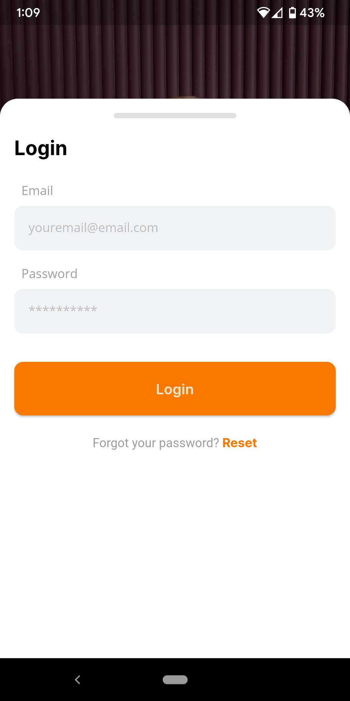
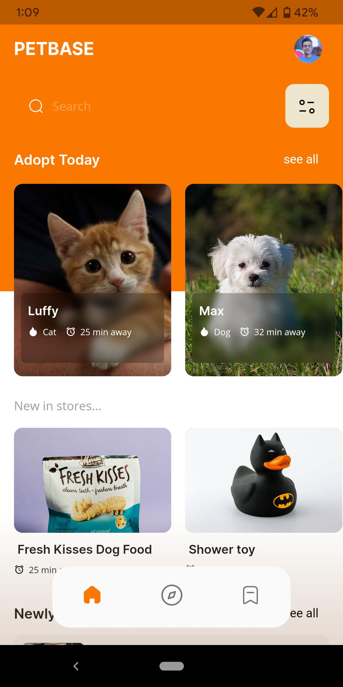
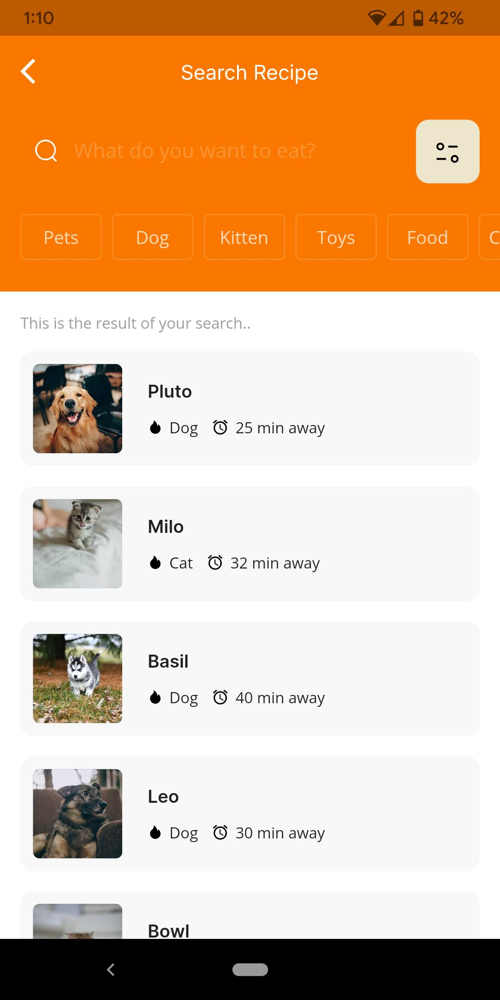

# PetBase.

## Introduction

Customized Flutter Frontend Pet Store and Adoption Application for Android

A modern and user-friendly mobile application built with Flutter, designed to facilitate pet adoption and showcase a variety of pets available for adoption. This application provides a seamless and engaging user experience, allowing users to browse different pets, view their details, and interact with the adoption process. It features an intuitive user interface, smooth animations, and responsive design for optimal performance on Android devices. 

Key Features:
- Browse and search for pets available for adoption
- View detailed pet profiles with descriptions, images, and adoption information
- Save favorite pets to revisit later
- Streamlined adoption process with easy-to-follow steps
- Integration with backend APIs for real-time data updates

This application is a demonstration of the capabilities of Flutter and serves as a starting point for building your own pet store or adoption app. Feel free to explore the code, contribute, and customize it to fit your specific requirements.

## App Screenshot

